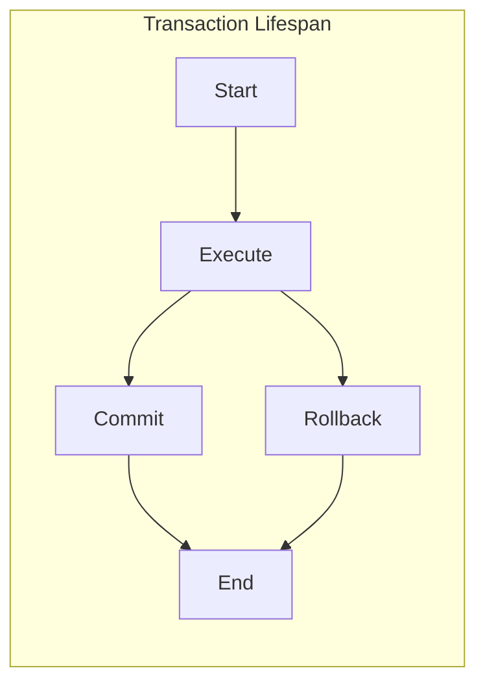

# postgresql

## Tablespace

In PostgreSQL, a **tablespace** is a location on the storage device where PostgreSQL stores data files. Tablespaces allow database administrators to define locations in the file system where the files representing database objects can be stored. Once created, a tablespace can be referred to by name when creating database objects. By using tablespaces, an administrator can control the disk layout of a PostgreSQL installation. 

To create a tablespace, use the `CREATE TABLESPACE` command followed by the name of the tablespace and the location where the files will be stored. For example, to create a tablespace named `fastspace` at the location `/ssd1/postgresql/data`, you can use the following command:

```
CREATE TABLESPACE fastspace LOCATION '/ssd1/postgresql/data';
```

The location must be an existing, empty directory that is owned by the PostgreSQL operating system user. All objects subsequently created within the tablespace will be stored in files underneath this directory.

**EXAMPLE:**

Create a directory on the file system where you want to store the data files
This directory should be created and have appropriate permissions before using it in PostgreSQL
For example, let's say you create a directory '/path/to/mytablespace'

Create a tablespace using the specified directory

```
CREATE TABLESPACE mytablespace LOCATION '/path/to/mytablespace';
```

Now, any objects created within this tablespace will be stored in files underneath the specified directory.

Example: Create a table within the 'mytablespace' tablespace

```
CREATE TABLE mytable (
   id serial PRIMARY KEY,
   name VARCHAR(100)
) TABLESPACE mytablespace;
```

If you don't specify a tablespace when creating a table, PostgreSQL will use the default tablespace for the database. When you create a database, it is associated with a default tablespace, and any objects (like tables) created within that database without explicitly specifying a tablespace will be stored in the default tablespace.


## transaction

A transaction is a sequence of one or more SQL statements executed as a single unit of work.

The lifespan of a database transaction can be divided into the following stages:

1. **Initiation:** The transaction is started by calling the `BEGIN TRANSACTION` statement.
2. **Execution:** The database operations that are part of the transaction are executed.
3. **Commitment:** The transaction is committed by calling the `COMMIT` statement. This makes the changes made by the transaction permanent.
4. **Rollback:** The transaction is rolled back by calling the `ROLLBACK` statement. This restores the database to its state before the transaction started.

The lifespan of a transaction can be terminated prematurely at any stage. For example, if an error occurs during the execution of a transaction, the transaction will be rolled back automatically.

Here is a diagram of the lifespan of a database transaction:



Begin: A transaction begins with the execution of the BEGIN TRANSACTION statement. After this statement, any SQL operations are considered part of the transaction until it is explicitly ended.

Commit: If all the operations within a transaction are successful and the transaction is complete, it is committed using the COMMIT statement. This makes all the changes made during the transaction permanent.

Rollback: If an error occurs during the transaction or if it fails to meet certain criteria, the transaction can be rolled back using the ROLLBACK statement. This undoes all the changes made during the transaction, reverting the database to its state before the transaction started.

Transactions in databases follow the ACID properties, which stand for:

Atomicity: Transactions are atomic, meaning that either all the operations within the transaction are executed successfully, or none of them are. If any part of the transaction fails, the entire transaction is rolled back, and the database is left unchanged.

Consistency: Transactions ensure that the database moves from one valid state to another. The database must satisfy a set of integrity constraints before and after the transaction.

Isolation: Transactions in progress are isolated from other transactions. This means that the operations within a transaction are not visible to other transactions until the transaction is committed. This isolation helps prevent interference between concurrent transactions.

Durability: Once a transaction is committed, the changes made to the database are permanent and survive any subsequent failures. Even if the system crashes, the changes made by committed transactions are not lost.

**Atomicity** in the context of databases refers to one of the ACID properties, which stands for Atomicity, Consistency, Isolation, and Durability. Atomicity ensures that a transaction is treated as a single, indivisible unit of work. This means that either all the operations within the transaction are successfully completed, or none of them are. In other words, a transaction is atomic, or "indivisible," in the sense that it is all or nothing. If any part of the transaction fails, the entire transaction is rolled back, and the database is left unchanged. This rollback ensures that the database remains in a consistent state. Atomicity guarantees that transactions are either fully completed or have no effect at all, which helps maintain the integrity and reliability of the database despite failures or errors during the transaction process.

Examples of Transactions:

Order Processing: Processing an order typically involves updating inventory, customer information, and financial records. A transaction ensures that all these operations are completed successfully or none of them are applied.

Let's break down the concept of transactions in the context of order processing:

When a customer places an order, several related operations need to occur within a database system. These operations often involve updating multiple tables or records to ensure accurate and consistent data. In the case of order processing, the key operations usually include:

1. **Updating Inventory:**
   - Decreasing the quantity of items in the inventory to reflect the items sold in the order.
   - Ensuring that the inventory doesn't go below zero, indicating that the item is out of stock.

2. **Updating Customer Information:**
   - Recording the order details, such as the customer's name, shipping address, and contact information.
   - Keeping track of the customer's order history for future reference or customer support.

3. **Updating Financial Records:**
   - Calculating the total cost of the order, including items, taxes, and shipping charges.
   - Updating financial records, such as deducting the total cost from the customer's account or recording a new transaction.

Now, here's where transactions come into play:

### Without Transactions:
If these operations were not part of a transaction, and an error occurred after updating, say, the inventory but before updating the financial records, the database would be in an inconsistent state. The inventory would show items as sold, but the financial records wouldn't reflect the transaction. This inconsistency could lead to various issues, including incorrect financial reports and customer dissatisfaction.

### With Transactions:
By encapsulating all these operations within a transaction, the database management system ensures that either all the operations (updating inventory, customer information, and financial records) are completed successfully, or none of them are applied. Here's how it works:

- **Atomicity:** If any part of the transaction fails (for instance, due to a database error, network issue, or any other issue), the entire transaction is rolled back. This means that all changes made within the transaction are undone, leaving the database in its original state.
  
- **Consistency:** The transaction ensures that the database moves from one valid state to another. In this case, the database transitions from a state before the order was placed to a state where inventory is updated, customer information is recorded, and financial records are accurate.

- **Isolation:** While the transaction is in progress, its operations are isolated from other transactions. This prevents interference from other transactions that might be occurring concurrently.

- **Durability:** Once the transaction is successfully completed (all operations within the transaction are committed), the changes become permanent and are saved even if there's a system failure. This ensures that the database can recover to a consistent state after a crash or other unexpected events.

In summary, using transactions in order processing guarantees that the database remains consistent and reliable, even if errors or failures occur during the processing of an order. It helps maintain data integrity and ensures that the database accurately reflects the state of the business operations.


## begin work. transaction

The `BEGIN WORK` command in psql is used to start a transaction. A transaction is a unit of work that is performed on the database, and it ensures that all of the changes made within the transaction are either committed or rolled back.

To start a transaction in psql, you simply type the `BEGIN WORK` command and then press Enter. You can then execute any SQL statements that you want to include in the transaction. To commit the transaction, type the `COMMIT` command and press Enter. To roll back the transaction, type the `ROLLBACK` command and press Enter.

Here is an example of a simple transaction in psql:

```
BEGIN WORK;

INSERT INTO users (name, email) VALUES ('John Doe', 'john.doe@example.com');
UPDATE users SET name = 'Jane Doe' WHERE id = 1;

COMMIT;
```

This transaction will insert a new user into the `users` table and then update the name of the user with the ID 1 to `Jane Doe`. If either of these statements fails, the entire transaction will be rolled back and the database will be returned to its previous state.

It is important to note that transactions are not enabled by default in psql. To enable transactions, you can add the following line to your `.bashrc` file:

```
export PGOPTIONS="--autocommit=off"
```

Once you have enabled transactions, you will need to start a transaction explicitly using the `BEGIN WORK` command before you can make any changes to the database.

Transactions are useful for ensuring that your database is always in a consistent state. For example, if you are transferring money between two accounts, you would want to use a transaction to ensure that either both transfers are successful or neither of them are successful.

## begin vs begin work

The `BEGIN` and `BEGIN WORK` commands in psql are functionally equivalent. Both commands are used to start a transaction.

The only difference between the two commands is that `BEGIN` is the SQL-standard command, while `BEGIN WORK` is a PostgreSQL extension.

The `BEGIN WORK` command is more commonly used in psql because it is more verbose and easier to remember. The `BEGIN` command is typically used in scripts or when writing SQL code that needs to be compatible with other database systems.

Here is an example of how to use the `BEGIN` and `BEGIN WORK` commands:

```
-- BEGIN
INSERT INTO users (name, email) VALUES ('John Doe', 'john.doe@example.com');
UPDATE users SET name = 'Jane Doe' WHERE id = 1;
COMMIT;

-- BEGIN WORK
INSERT INTO users (name, email) VALUES ('Jane Doe', 'jane.doe@example.com');
UPDATE users SET name = 'John Doe' WHERE id = 1;
COMMIT;
```

Both of these code blocks will produce the same result: two new users will be inserted into the `users` table, and the name of the user with the ID 1 will be updated to `Jane Doe`.

Which command you use to start a transaction is a matter of personal preference. However, I recommend using the `BEGIN WORK` command because it is more verbose and easier to remember.
